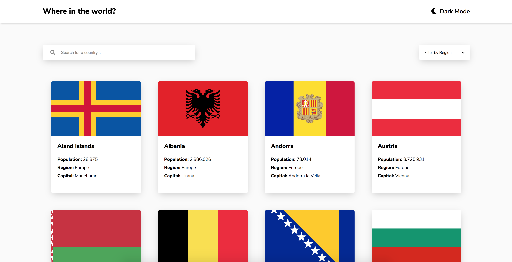

# REST Countries API with color theme switcher solution

## Table of contents

- [Overview](#overview)
  - [The project goals](#the-project-goals)
  - [Screenshot](#screenshot)
  - [Links](#links)
- [My process](#my-process)
  - [Built with](#built-with)
  - [What I learned](#what-i-learned)
  - [Continued development](#continued-development)
  - [Useful resources](#useful-resources)
- [Author](#author)
- [Acknowledgments](#acknowledgments)


## Overview

### The project goals

Users should be able to:

- See all countries from the API on the homepage
- Search for a country using an `input` field
- Filter countries by region
- Click on a country to see more detailed information on a separate page
- Click through to the border countries on the detail page
- Toggle the color scheme between light and dark mode

### Screenshot



### Links

- Solution URL: [https://github.com/GrahamKirwan/Where-in-the-world](https://github.com/GrahamKirwan/Where-in-the-world)
- Live Site URL: [https://where-in-the-world-xi.vercel.app/](https://where-in-the-world-xi.vercel.app/)

## My process

### Built with

- Semantic HTML5 markup
- SASS & CSS variables
- Flexbox
- Mobile-first workflow
- Vanilla JS
- RESTCOUNTRIES API


### What I learned

For toggable light/dark themes we can grab root css varibles and update the values

```js
function myFunction_set_dark() {
  r.style.setProperty('--light-bg', 'hsl(207, 26%, 17%)');
  r.style.setProperty('--white', 'hsl(209, 23%, 22%)');
  r.style.setProperty('--black', '#fff');
  r.style.setProperty('--dark-grey', '#fff');
}
```


### Continued development

-Pagination
-Make borders clickable
-Break up JS code to follow MVC


## Author

- Website - [Graham Kirwan](https://grahamkirwan.github.io/)


